# Who Is Churning and Why
_Subscribers churn. The pipeline cannot._

- **Domain:** pipeline_architecture
- **Difficulty:** Medium
- **Est. time:** 20 min
- **URL:** https://datadriven.io/problems/who_is_churning_and_why

## Problem

We run a SaaS subscription platform with monthly and annual plans across multiple product tiers. The finance and growth teams need a unified analytics layer that can answer: which cohorts churn fastest, what is monthly recurring revenue by tier, and which accounts are at risk of non-renewal. Right now subscription data lives in the application database and no one can query it for analytics without hitting production. Design the pipeline and data model.

**Concepts tested:** `paBatchProcessing`, `paCdc`, `paDagOrchestration`, `paDataLake`, `paDataQuality`, `paDeduplication`, `paEltVsEtl`, `paFullVsIncremental`, `paIdempotency`, `paLateData`, `paMonitoring`, `paPartitioning`, `paScdPipeline`

## Requirements

- Finance reconciles MRR against the billing provider's dashboard; today the two diverge by enough that finance can't sign off.
- Mid-cycle upgrades and downgrades change MRR on the day they happen; the intraday dashboard has to reflect them within the next refresh.
- Some cancellations are immediate and some are end-of-period; MRR drops on the day for the first, continues to period end for the second, and the warehouse has to model both.
- When a churned account comes back, cohort retention curves have to keep treating them as the original cohort, not as a new acquisition.

## Must-have components

- MRR facts, plan-change history, and cohort tables live in a warehouse for finance and growth. Without a warehouse tier there's nowhere for the MRR model. Add Snowflake, BigQuery, Redshift, or Databricks.
- Plan changes, cancellations, and reactivations have to be captured as timestamped events without polling production. Add a CDC capture mechanism reading the change log.

**Expected stages:** `subscription_event_cdc` → `dim_account_scd2` → `fact_mrr_daily` → `fact_subscription_events` → `churn_risk_mart`

## Solution walkthrough

### What this really is

This is event sourcing presented as a dashboard request. Every metric finance and growth want (MRR by tier, cohort churn, renewal risk) is a fold over subscription lifecycle events, and the application database only stores the latest state of each row. Anyone can draw Postgres flowing into a warehouse. What separates candidates is whether the history survives the copy. **Snapshot the subscriptions table nightly** and three things break: a mid-cycle upgrade is invisible until the next snapshot, a cancellation has one end date and no kind, and a reactivated account overwrites its signup date and turns up as a brand-new acquisition.

> **MRR is derived from events, never read off a column**
>
> Capture every signup, plan change, cancellation and reactivation through CDC as a timestamped row. `fact_mrr_daily` is computed from that log, so you can rebuild any past day and reconcile it. A `current_mrr` column can only show you today.

### Walk the requirements

**Step 1: Capture changes without touching production**

CDC reads the database's change log, so analytics never queries the primary. Polling `updated_at` can miss a row that changed twice between polls, which is exactly how an upgrade followed by a downgrade disappears. Dedupe on `event_id` in `fact_subscription_events`, because the connector delivers at least once.

**Step 2: Refresh MRR hourly from the event log**

Plan-change events reach the lake within minutes. The hourly dbt run rebuilds today's partition of `fact_mrr_daily`, so an upgrade at 10:00 is on the dashboard by 11:00 and not at month end. Partition overwrite keeps reruns idempotent.

**Step 3: Put `cancellation_kind` on the event**

An 'immediate' cancellation drops MRR on the event date. An '`end_of_period`' cancellation keeps MRR flowing until `period_end`. Any single rule gets one of the two wrong, and finance sees that as unexplained drift.

**Step 4: Freeze `cohort_date` in `dim_account_scd2`**

SCD2 versions the account's tier and status, but `cohort_date` is written once at first signup and never updated. A reactivation opens a new version with the original cohort, so retention curves show a return and not a new logo.

### The reference design

```mermaid
flowchart LR
    subscription_event_cdc["subscription_event_cdc<br/>CDC"]
    cdc_stream["cdc_stream<br/>Kafka"]
    raw_events_lake["raw_events_lake<br/>Delta Lake"]
    fact_subscription_events["fact_subscription_events<br/>dbt"]
    dim_account_scd2["dim_account_scd2<br/>dbt"]
    fact_mrr_daily["fact_mrr_daily<br/>dbt"]
    analytics_warehouse["analytics_warehouse<br/>Snowflake"]
    billing_provider["billing_provider<br/>API"]
    mrr_reconciliation["mrr_reconciliation<br/>Great Expectations"]
    churn_risk_mart["churn_risk_mart<br/>dbt"]
    finance_dashboard["finance_dashboard<br/>Tableau"]
    growth_dashboard["growth_dashboard<br/>Looker"]
    subscription_event_cdc --> cdc_stream
    cdc_stream --> raw_events_lake
    raw_events_lake --> fact_subscription_events
    fact_subscription_events --> dim_account_scd2
    fact_subscription_events --> fact_mrr_daily
    dim_account_scd2 --> fact_mrr_daily
    fact_subscription_events --> analytics_warehouse
    dim_account_scd2 --> analytics_warehouse
    fact_mrr_daily --> analytics_warehouse
    analytics_warehouse --> mrr_reconciliation
    billing_provider --> mrr_reconciliation
    mrr_reconciliation --> finance_dashboard
    analytics_warehouse --> churn_risk_mart
    churn_risk_mart --> growth_dashboard
```

| node | type | tech | details |
|---|---|---|---|
| subscription_event_cdc | source | CDC |  |
| cdc_stream | queue | Kafka |  |
| raw_events_lake | storage | Delta Lake | backfillStrategy: partition_overwrite |
| fact_subscription_events | transform | dbt | slaFreshness: < 1h; idempotencyStrategy: upsert |
| dim_account_scd2 | transform | dbt | slaFreshness: < 1h; idempotencyStrategy: upsert |
| fact_mrr_daily | transform | dbt | slaFreshness: < 1h; idempotencyStrategy: upsert |
| analytics_warehouse | storage | Snowflake | slaFreshness: < 1h; backfillStrategy: partition_overwrite |
| billing_provider | source | API |  |
| mrr_reconciliation | quality_gate | Great Expectations | errorAction: alert; monitorAlert: Warehouse MRR differs from billing provider past tolerance |
| churn_risk_mart | transform | dbt | slaFreshness: < 24h |
| finance_dashboard | consumer | Tableau |  |
| growth_dashboard | consumer | Looker |  |

| Nightly snapshot | CDC event log |
|---|---|
| One row per subscription with the latest `plan_id` and `canceled_at`. Intraday changes are lost, the cancellation kind is guessed, and reactivation overwrites `created_at`. | One row per lifecycle event with `event_ts` and `cancellation_kind`. Any day's MRR can be rebuilt, both cancellation kinds are modeled, and the original cohort survives. |

> **Reconciliation that only reports**
>
> Candidates add a comparison to the billing provider and send its output to a dashboard nobody opens. The check has to sit in front of the finance publish. Break the drift down by tier, so a failure points at the plan changes and cancellations for that tier.

> **Where `cohort_date` comes from**
>
> Ask the candidate which column defines a cohort and what writes it. If the answer is the application's `created_at`, reactivations will reset it. A senior candidate states that `cohort_date` is set once and that SCD2 versions everything else.

- **A customer cancels end of period and reactivates the day after `period_end`. What do MRR and the cohort show?**
  - _MRR drops on `period_end` and resumes the next day. The account stays in its original cohort and counts as returned._
- **A CDC event for a plan change arrives six hours late. How does `fact_mrr_daily` correct the past day?**
  - _Tests late data handling: the job reprocesses affected partitions by `event_ts` and overwrites them idempotently._
