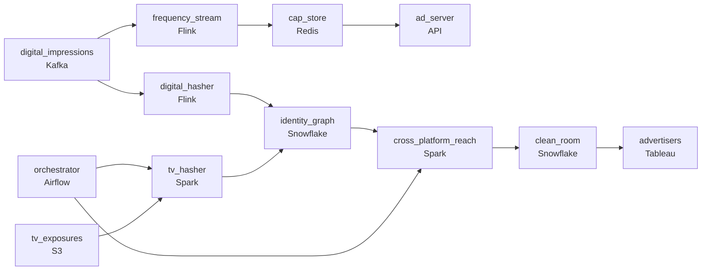

# Who Saw the Ad Twice
_TV and digital. Same viewer, two measurement worlds._

- **Domain:** pipeline_architecture
- **Difficulty:** Hard
- **Est. time:** 10 min
- **URL:** https://datadriven.io/problems/who_saw_the_ad_twice

## Problem

We measure advertising effectiveness across linear TV and digital platforms, but right now our TV and digital measurement pipelines are completely separate. Advertisers want to know the true unduplicated reach of a campaign that ran on both broadcast TV and connected apps. This requires joining second-level TV ad exposure logs from set-top boxes with digital impression logs, all without exposing raw PII. Design a pipeline that produces these cross-platform audience metrics.

**Concepts tested:** `paBatchProcessing`, `paDagOrchestration`, `paDataQuality`, `paDeduplication`, `paFileIngestion`, `paLateData`, `paPartitioning`

## Requirements

- Advertisers want one number for how many people saw their campaign across TV and digital, not two separate numbers that double-count households.
- We can't fail a CCPA audit; raw personal identifiers can't move between datasets the way they do today.
- The ad server checks frequency caps on every impression and the lookup has to feel instant or the cap doesn't apply.
- Advertisers expect their measurement report by morning the day after; if it's late, that's a contract breach.

## Must-have components

- Deduplicated audiences are distributed to advertisers via a warehouse-backed clean room so raw identifiers never leave the environment. Without a warehouse tier there's no place to publish the audience without exposing PII. Add a warehouse (Snowflake, BigQuery, Databricks).
- The ad server checks frequency caps on every impression; if the lookup isn't sub-minute, the cap doesn't apply in time. Add a streaming / low-latency serving path so the cap state is available to the ad server in real time.

**Expected stages:** `ad_exposures_tv` → `ad_exposures_digital` → `identity_graph` → `cross_platform_reach`

## Solution walkthrough

### What this really is

This is a household-level set union dressed up as ad measurement, with a latency split hiding inside it. Anyone can count distinct viewers. What separates candidates is seeing that TV and digital carry **different identifiers for the same household**, so the union only works through an identity graph keyed on hashed ids. The second tell is that frequency capping is a different pipeline entirely: the ad server asks on every impression and cannot wait for a warehouse. Miss the graph and you double-count every household that saw both. Miss the hashing and raw PII sits in one warehouse when the CCPA assessor looks.

> **Two consumers, two paths, one identity layer**
>
> Hash identifiers inside each source, resolve them to a stable household key in `identity_graph`, and count distinct on that key. The morning report is a batch job published to a warehouse clean room. The cap lookup is a streaming path into a key-value store. They share the hashing, not the storage.

### Walk the requirements

**Step 1: Count households, never sum platforms**

A set-top box id and a mobile device id never match on equality. `identity_graph` maps both hashed ids to one household key, and `cross_platform_reach` counts distinct on that key. Summing TV reach and digital reach is exactly the double count the advertiser is paying to remove.

**Step 2: Hash in place, move only hashes**

Each platform salts and hashes its own identifiers before anything leaves its dataset. Only hashed ids, the graph mapping and aggregates cross. Centralising raw emails and device ids to make the join easy is the design that fails the audit.

**Step 3: Give the ad server its own store**

A Flink job tails `digital_impressions` and updates per-household counters in Redis. The ad server reads that on every request in single-digit milliseconds. Pointing it at the warehouse costs hundreds of milliseconds, the cap arrives late, and campaigns over-deliver.

**Step 4: Order the night and alert early**

Airflow runs identity refresh, then measurement, then the clean-room publish, each with its own SLA. A late identity refresh pages someone at 2am with hours to recover, not at 9am when the contract is already breached.

| node | type | tech | details |
|---|---|---|---|
| tv_exposures | source | S3 |  |
| digital_impressions | source | Kafka | parallelism: 16 partitions |
| tv_hasher | transform | Spark | errorAction: alert |
| digital_hasher | transform | Flink | errorAction: alert; slaFreshness: real-time |
| identity_graph | storage | Snowflake | slaFreshness: < 24h |
| frequency_stream | transform | Flink | slaFreshness: real-time |
| cap_store | storage | Redis | slaFreshness: real-time |
| ad_server | consumer | API | slaFreshness: real-time |
| orchestrator | transform | Airflow | errorAction: alert; monitorAlert: Identity refresh or measurement job late vs morning SLA |
| cross_platform_reach | transform | Spark | slaFreshness: < 24h; idempotencyStrategy: staging_table |
| clean_room | storage | Snowflake | slaFreshness: < 24h |
| advertisers | consumer | Tableau | slaFreshness: < 24h |

| The whiteboard answer | The design that survives |
|---|---|
| Copy TV logs into the digital warehouse, join on email, add the two reach counts, and let the ad server query the same warehouse for caps. | Hash per source, count distinct on the household key from `identity_graph`, publish to a clean room, and serve caps from `cap_store` on a streaming path. |

> **One pipeline cannot serve both clocks**
>
> Candidates draw a single Spark job and hang both the report and the ad server off it. The report is fine at daily freshness. The cap is useless at daily freshness, and campaigns over-deliver until finance issues refunds.

> **Where the hash happens is the tell**
>
> Strong candidates draw the hasher before any cross-dataset edge, unprompted. A hasher placed after the join means raw ids already moved, and the reviewer stops reading.

- **A third measurement partner joins next quarter. What in this design extends and what does not?**
  - _The partner becomes one more hashed source feeding `identity_graph`; measurement inherits it._
- **The Redis cap counts start disagreeing with the morning report. Where does the gap come from?**
  - _The cap store is approximate and fast; the report is exact. Reconcile at the day boundary instead of chasing perfect consistency._
